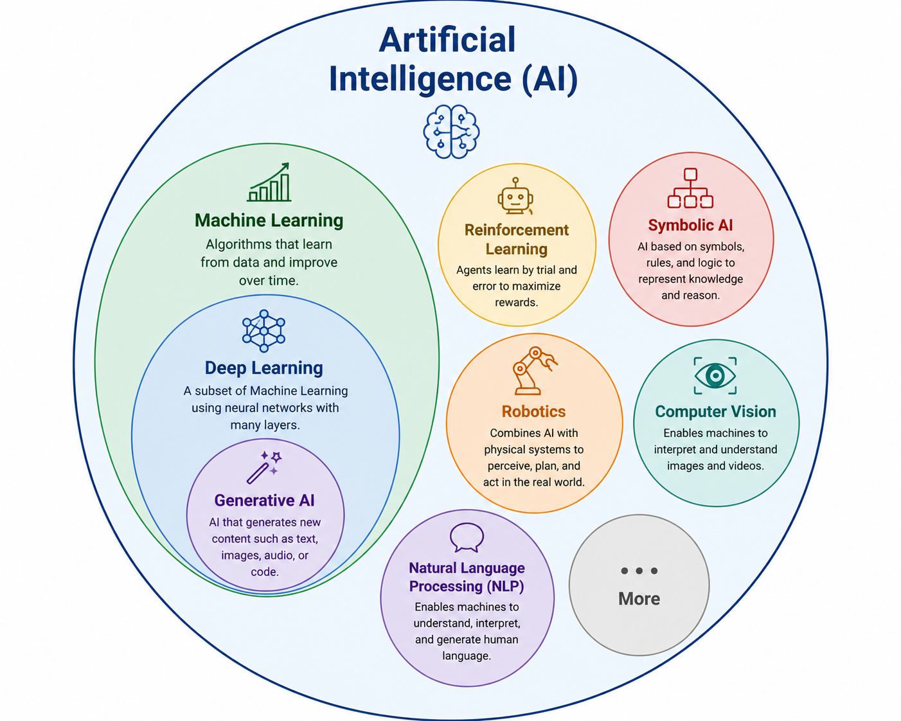

# Introduction to Artificial Intelligence

## What is Artificial Intelligence?

Artificial Intelligence (AI) is a field of computer science focused on building systems capable of performing tasks that normally require human intelligence.

Typical AI tasks include:

- Decision-making
- Learning from data
- Pattern recognition
- Problem solving
- Understanding language
- Perception (images, audio, video)


AI is an umbrella term that includes several subfields.

<p>
  
</p>

---
## Machine Learning (ML)

Machine Learning enables computers to learn patterns directly from data instead of relying on explicitly programmed rules.

Instead of writing every rule manually, the model discovers relationships automatically during training.

### Deep Learning (DL)

Deep Learning is a subset of Machine Learning.

It uses artificial neural networks with many layers (deep neural networks) to learn complex patterns from large datasets.

This course primarily focuses on **Deep Learning**.

---

## Rule-Based Systems vs Machine Learning

A classic spam filter can be implemented using manually written rules:

```text
IF email contains "FREE"          → Spam
IF email contains >5 "!"          → Spam
IF sender is on a blacklist       → Spam
```

### Problem

Rule-based systems are difficult to maintain because users constantly invent new ways to bypass the rules.

For example:

```text
FREE
F R E E
Fr33
F.R.E.E
```

Writing rules for every possible variation quickly becomes impossible.

Machine Learning solves this problem by **learning patterns from examples** instead of relying on manually created rules.

The model receives many labeled emails and learns to predict whether a new email is:

- Spam
- Not Spam

The output is a **prediction (classification)**.

---

# What about Generative AI?

Traditional Machine Learning predicts an output such as:

- Spam / Not Spam
- Cat / Dog
- House price
- Customer will leave / stay

Generative AI works differently.

Instead of predicting a class or a numeric value, it **generates new content**.

Examples include:

- Text
- Images
- Audio
- Music
- Source code

---

## How does Generative AI learn?

Generative AI is trained on extremely large datasets, including:

- Books
- Articles
- Websites
- Source code
- Images
- Audio and music

Rather than learning *"What is spam?"*, the model learns statistical relationships within the data.

For language models, the training objective is typically:

> **Predict the most likely next word (or token).**

Example:

```text
Today the weather is ...
```

Possible continuations:

- sunny
- beautiful
- rainy
- cold

The model selects the most probable continuation based on patterns learned from billions of examples.

# Brief History

https://aibridge.pef.czu.cz/history/