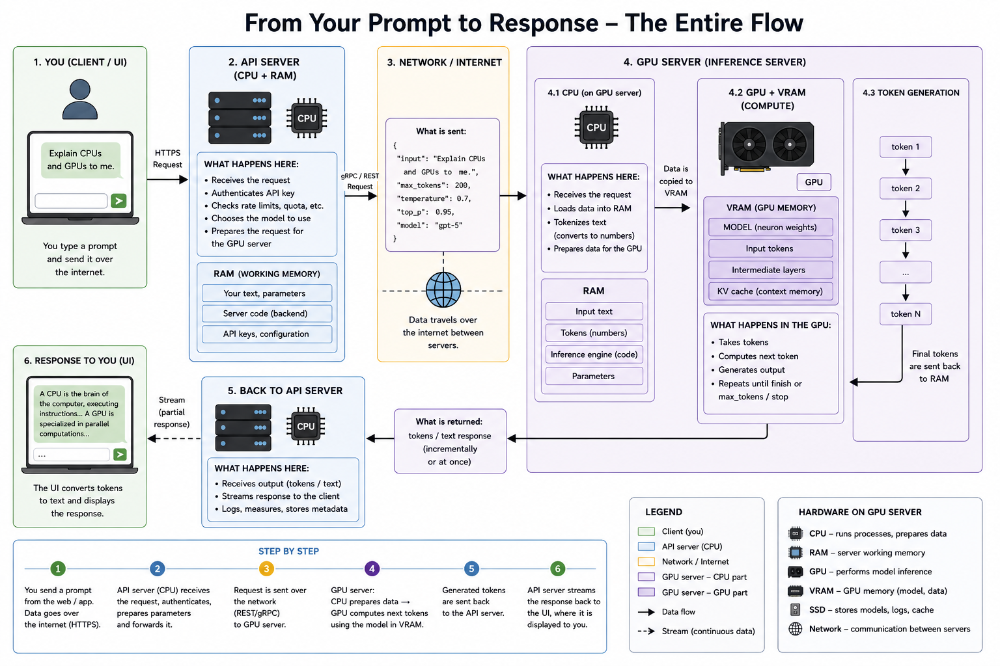

# LLM Infrastructure

Modern LLM applications consist of much more than a language model.

A typical production system includes:

- frontend
- APIs
- orchestration
- retrieval
- inference servers
- monitoring

---

# Request Lifecycle

A typical request follows these steps:

```
User

↓

Frontend

↓

HTTP Request

↓

API Gateway

↓

Backend

↓

LLM

↓

Response
```

Detailed workflow:

1. User submits a prompt.
2. The frontend sends an HTTP request.
3. The API Gateway authenticates and validates the request.
4. The backend prepares the request.
5. The LLM generates a response.
6. The response is streamed back to the user.

---

# High-Level Architecture

<p align="center">

</p>

Typical components:

- Frontend
- API Gateway
- Backend Services
- LLM Servers
- Databases
- Monitoring

---

# Frontend

The frontend is the interface used by the user.

Examples:

- web browser
- mobile application
- desktop application

Responsibilities:

- collect user input
- display responses
- stream generated tokens

---

# API Gateway

The API Gateway is the entry point into the system.

Responsibilities:

- authentication
- authorization
- request validation
- rate limiting
- logging

It protects backend services from invalid or malicious requests.

---

# Backend Services

The backend coordinates the entire workflow.

Typical responsibilities:

- prompt construction
- context engineering
- conversation history
- RAG
- orchestration
- batching
- tool calling

The backend determines **what the model should actually receive**.

---

# Retrieval Layer (Optional)

Many production systems use Retrieval-Augmented Generation (RAG).

Pipeline:

```
User Query

↓

Embedding

↓

Vector Database

↓

Relevant Documents

↓

LLM
```

This allows the model to answer using:

- company documents
- databases
- internal knowledge

---

# Tokenization

Before inference, the prompt is converted into tokens.

```
"What is AI?"

↓

["What", "is", "AI", "?"]
```

The tokenizer converts tokens into numerical IDs that the model can process.

---

# Model Server

The model server performs inference.

Responsibilities:

- tokenization
- inference
- decoding
- streaming

Most modern LLMs run on GPUs or specialized AI accelerators.

---

# GPU Inference

Inference consists of repeatedly predicting the next token.

```
Prompt

↓

Transformer

↓

Next Token

↓

Repeat
```

This process continues until:

- EOS token
- max_tokens
- stop sequence

---

# Batching

Instead of processing one request at a time, servers combine multiple requests into a single GPU batch.

Advantages:

- higher GPU utilization
- lower infrastructure cost
- improved throughput

---

# KV Cache

Transformers reuse previously computed attention states.

Instead of recomputing the entire prompt for every new token, the model stores intermediate attention values.

Advantages:

- much faster generation
- lower latency

KV caching is one of the most important optimizations in modern LLM serving.

---

# Streaming

Responses are usually streamed token by token.

Without streaming:

```
(wait)

↓

Complete response
```

With streaming:

```
H

He

Hel

Hello...
```

Benefits:

- lower perceived latency
- improved user experience

---

# Example API Request

```json
{
  "model": "gpt-5",
  "input": "Tell me a joke.",
  "temperature": 0.7,
  "max_output_tokens": 200
}
```

---

# Scalability

Production systems must handle thousands or millions of requests.

Common techniques:

- load balancing
- horizontal scaling
- autoscaling
- GPU scheduling
- distributed inference

---

# Monitoring

Modern AI systems continuously monitor:

- latency
- throughput
- token usage
- cost
- failures
- safety
- user feedback

Monitoring is essential for reliable production deployment.

---

# Complete Infrastructure

```
User

↓

Frontend

↓

API Gateway

↓

Backend

↓

RAG / Tools

↓

Model Server (GPU)

↓

Streaming

↓

User
```

---

# Summary

Modern LLM infrastructure consists of several layers:

- frontend
- API Gateway
- backend orchestration
- retrieval (optional)
- model servers
- GPU inference
- batching
- KV cache
- streaming
- monitoring

The language model is only one component of a much larger production system.