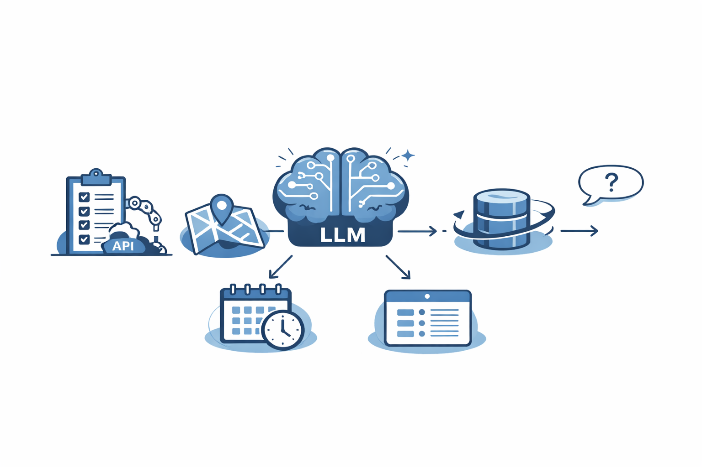
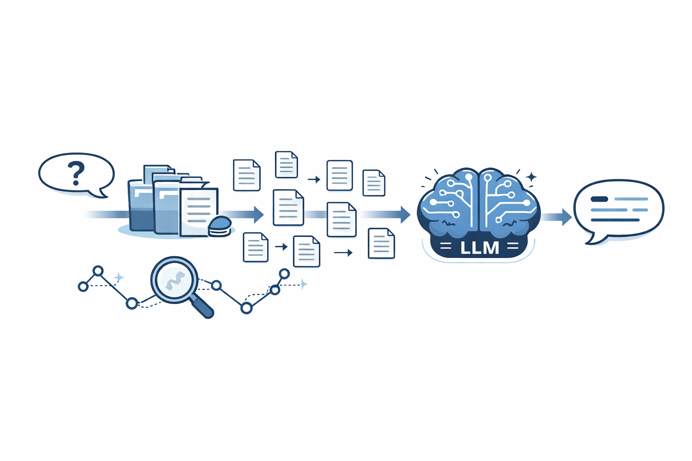
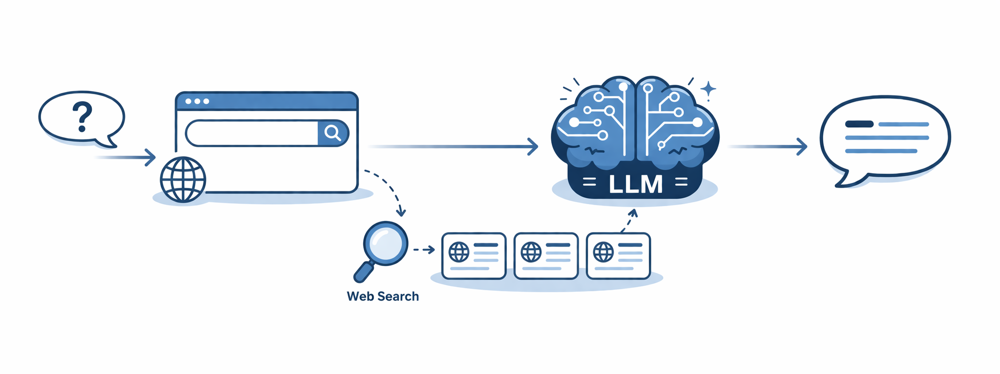
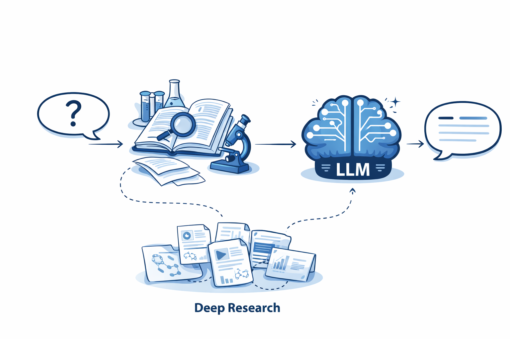
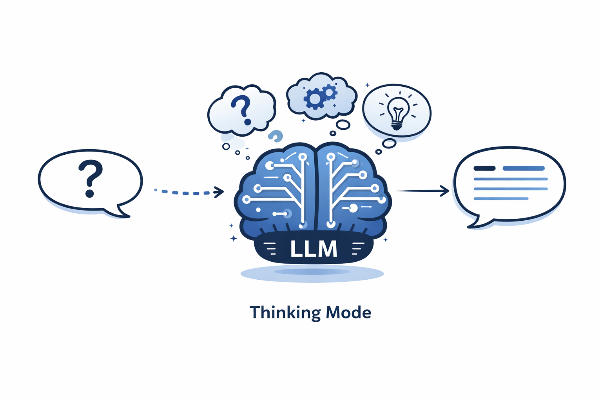
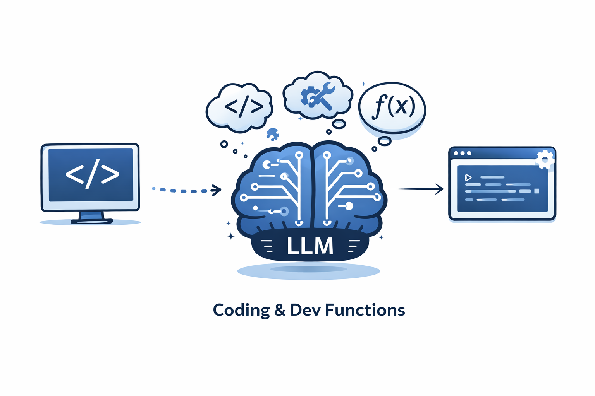
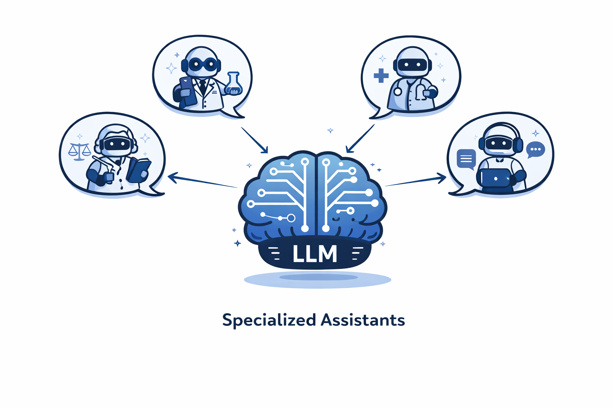

# Modern LLM Capabilities

## Introduction

Modern LLM systems are much more than language models.

They combine:

- Large Language Models (LLMs)
- external knowledge
- tools
- reasoning
- integrations

Together, these components enable LLMs to work with up-to-date information, company data, external services, files, and software development workflows.

<p>
  
</p>

---

# Retrieval-Augmented Generation (RAG)

RAG combines **retrieval** with **text generation**.

Instead of answering only from its training data, the model first retrieves relevant information (for example from company documents or databases) and then generates an answer using that information as context.

This greatly improves:

- accuracy
- factuality
- access to up-to-date knowledge

### How it works

1. Documents are split into **chunks**.
2. Each chunk is converted into an **embedding**.
3. Embeddings are stored in a **vector database**.
4. The user's query is embedded.
5. The most similar chunks are retrieved (e.g., cosine similarity).
6. Retrieved chunks become part of the model's context.

```json
{
  "text": "Chunk content...",
  "embedding": [0.12, 2.6, 4.3, ...]
}
```

- retrieval + generation
- chunking
- embeddings
- vector databases
- improved factual accuracy

<p>
  
</p>

Example:

```text
[INSTRUCTIONS]
Answer using the provided context.

[CONTEXT]
Chunk A
Chunk B
Chunk C

[QUESTION]
How does Redis caching work?
```

---

# Web Search

Web Search enables the model to retrieve **current information** from the Internet.

When necessary, the model:

1. generates a search query,
2. searches the web,
3. selects relevant sources,
4. extracts useful information,
5. generates a final answer.

The overall pipeline is very similar to RAG, except that the data source is the web instead of a private knowledge base.

```json
{
  "tool": "web_search",
  "query": "weather Prague today"
}
```

- current information
- search APIs
- source selection
- synthesis of multiple sources

<p>
  
</p>

---

# Deep Research

Deep Research simulates the workflow of a human researcher.

Instead of answering immediately, the model:

- decomposes the task into smaller questions,
- performs multiple searches,
- evaluates retrieved information,
- stores intermediate findings,
- synthesizes the final report.

Compared to Web Search, it is slower but significantly more thorough.

Typical use cases:

- literature review
- market analysis
- competitive research
- strategic planning

<p>
  
</p>

---

# Shopping Research

Shopping Research is a specialized form of Deep Research focused on products.

The model compares:

- specifications
- prices
- reviews
- alternatives

and recommends the most suitable option for the user's requirements.

---

# Reasoning Models (Thinking Mode)

Reasoning models allocate additional computation before producing the final answer.

Instead of immediately generating text, they spend more time analyzing the problem.

This improves performance on tasks such as:

- mathematics
- programming
- planning
- logical reasoning

Unlike RAG or Web Search, reasoning **does not introduce new information**.

It simply helps the model make better use of the information it already has.

<p>
  
</p>

---

# File Generation

Language models generate **text**, not files.

When creating outputs such as:

- PDF
- DOCX
- Excel
- PowerPoint

the model calls an external tool that generates the file from the produced content.

```json
{
  "tool": "create_pdf",
  "content": "..."
}
```

Typical workflow:

Model

↓

Generate content

↓

External tool

↓

Create file

---

# Coding & Software Development

Modern LLMs are widely used for software development.

They can:

- generate code
- explain code
- refactor code
- debug programs
- write tests
- analyze repositories

Unlike natural language, programming languages have strict syntax, making correctness particularly important.

<p>
  
</p>

---

# Custom GPTs

Custom GPTs are specialized AI assistants built for a particular task or domain.

They combine:

- a base language model
- system instructions
- custom knowledge
- optional tools (e.g., RAG or Web Search)

Examples include:

- customer support assistants
- legal assistants
- educational tutors
- internal company assistants

Custom GPTs make it possible to adapt a general-purpose LLM to a specific use case without training a new model.

<p>
  
</p>

---

# Summary

Modern AI systems extend traditional language models with additional capabilities.

Common components include:

- Retrieval-Augmented Generation (RAG)
- Web Search
- Deep Research
- Shopping Research
- Reasoning Models
- File Generation
- Coding Assistance
- Custom GPTs

Most modern AI applications are built by combining several of these capabilities rather than relying solely on the language model itself.