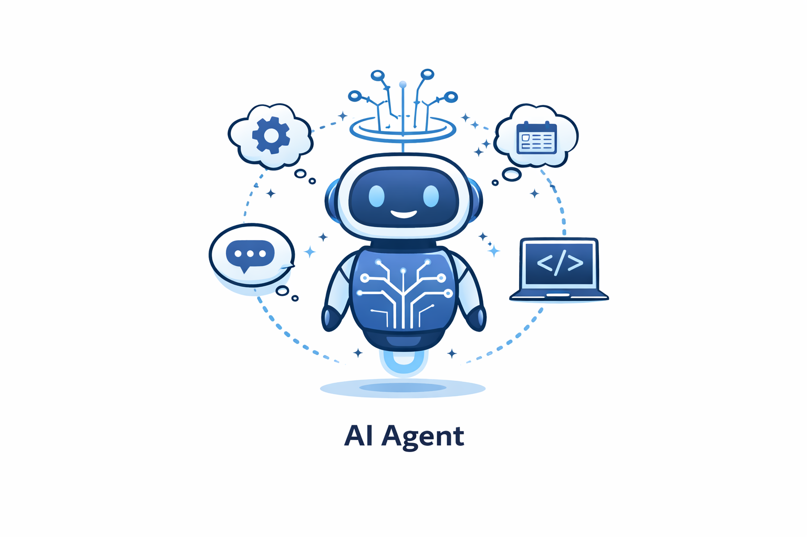

# AI-Assisted Software Development

## Code LLMs

Code LLMs are language models specialized for software development.

Unlike natural language, programming requires:

- strict syntax
- logical consistency
- long-context understanding
- deterministic behavior

Modern frontier models are trained on large amounts of:

- source code
- documentation
- public repositories
- technical discussions

As a result, they can:

- generate code
- explain code
- debug applications
- refactor projects
- generate tests


> Today, most frontier LLMs are strong coding models.
>
> Specialized code models still exist, but the distinction between "general" and "coding" models is becoming less significant.

---

# AI Coding Assistants

## GitHub Copilot

<p>

</p>

GitHub Copilot is an AI coding assistant integrated directly into the IDE.

It can:

- autocomplete code
- generate functions
- explain code
- refactor code
- review pull requests
- answer programming questions

Recent versions also include **Agent Mode**, allowing Copilot to perform more autonomous coding tasks.

Technically:

- sends the relevant project context to an LLM
- receives generated code
- integrates directly into the editor

---

## Cursor

AI-first code editor based on VS Code.

Features:

- integrated AI chat
- code generation
- repository-wide understanding
- refactoring
- inline editing
- agent workflows

Cursor combines a traditional IDE with modern AI capabilities.


---

## Amazon Q Developer

Amazon's AI coding assistant.

Optimized for:

- AWS services
- cloud development
- infrastructure-as-code
- DevOps workflows

---

## Tabnine

One of the earliest AI coding assistants.

Focuses on:

- privacy
- local deployment
- enterprise environments

Can run:

- locally
- in a private cloud

---

# AI for Testing

Before the rise of AI, software testing was largely a manual process.

Developers had to:

- write unit tests
- create mocks
- design test cases
- maintain tests after code changes

Modern LLMs significantly simplify this process.

They can automatically:

- generate unit tests
- generate integration tests
- create mocks
- explain existing tests
- generate test documentation

Specialized tools include:

- Diffblue Cover
- Qodo (formerly CodiumAI)

These tools focus on:

- improving test quality
- increasing code coverage
- automating test generation
- integrating with CI/CD pipelines

### New Challenges

AI also introduced new testing problems:

- validating AI-generated code
- evaluating non-deterministic LLM outputs
- testing prompts and AI workflows
- regression testing for LLM applications

---

# AI for Security

Before AI, software security relied mainly on:

- manual code reviews
- static analysis
- penetration testing

Modern AI assists developers by automatically detecting vulnerabilities, explaining security risks, and suggesting fixes.

Common security issues include:

- SQL Injection
- Cross-Site Scripting (XSS)
- Cross-Site Request Forgery (CSRF)
- Command Injection
- Hardcoded Secrets
- Insecure Dependencies

Examples of AI-powered security tools:

- Snyk Code
- GitHub Advanced Security
- SonarQube
- Semgrep

These tools combine:

- static analysis
- vulnerability databases
- machine learning
- LLMs for explanations and code fixes

### New AI Security Challenges

Modern AI systems introduce entirely new attack vectors:

- Prompt Injection
- Jailbreaks
- Data Leakage
- Tool Injection
- RAG Poisoning
- AI-generated phishing and malware
---

# AI for Code Modernization

## Modernize CLI

Helps migrate legacy software.

Typical use cases:

- framework upgrades
- API migrations
- language upgrades
- automated refactoring

Uses:

- Abstract Syntax Trees (AST)
- transformation rules
- AI-assisted refactoring

---

# What is an AI Agent?

<p>

</p>

An AI agent is a system capable of:

- perceiving its environment
- reasoning about a task
- performing actions
- evaluating results
- repeating the process until the goal is achieved

---

## Agent Workflow

### Perception

Receives information:

- prompt
- files
- repository
- terminal output

↓

### Reasoning

Plans the next step.

↓

### Action

Uses tools:

- terminal
- Git
- APIs
- test runner
- file system

↓

Receives new information and repeats the cycle.

---

# Coding Agents

Modern coding agents go far beyond simple code generation.

They can:

- write code
- edit files
- execute commands
- run tests
- fix bugs
- create pull requests
- iterate until the task is completed

---

# High-Level Agent Workflow

```
User Prompt

↓

Planning

↓

Tool Usage

↓

Evaluate Results

↓

Repeat
```

The agent continuously decides what to do next until the objective is achieved.

---

# The Agent Loop

```
User

↓

LLM

↓

Tool Request

↓

Orchestrator

↓

Tool Execution

↓

Result

↓

LLM

↓

Next Decision
```

Unlike traditional tool calling, the process is iterative.

---

# Components of an AI Agent

## LLM

Responsible for:

- understanding
- planning
- reasoning
- generating code

---

## Orchestrator

Responsible for:

- coordinating execution
- tracking progress
- managing the workflow
- deciding when to call tools

---

## Tools

Examples:

- terminal
- Git
- test runner
- linter
- APIs
- databases

---

# Execution Environment

Most coding agents execute code inside an isolated environment.

Typically:

- sandbox
- container
- cloud environment

Contains:

- repository
- runtime
- dependencies
- shell
- testing framework

Isolation improves:

- security
- reproducibility

---

# Tool Calling vs AI Agent

| Tool Calling | AI Agent |
|--------------|----------|
| Single tool invocation | Continuous execution loop |
| No planning | Planning |
| Stateless | Tracks task progress |
| Limited autonomy | Autonomous decision making |

The key difference is the **iterative planning and execution loop**.

---

# Multi-Agent Systems

Instead of a single agent, multiple specialized agents collaborate.

Example:

- Agent A → implementation
- Agent B → testing
- Agent C → code review

Advantages:

- specialization
- parallel execution
- improved output quality

---

# Examples of Coding Agents

## OpenAI Codex

AI coding agent capable of:

- autonomous programming
- tool usage
- repository editing
- running tests
- iterative development

Runs inside a secure sandbox environment.

---

## Claude Code

Anthropic's coding agent.

Supports:

- planning
- repository editing
- terminal usage
- iterative software development

---

## OpenHands

Open-source coding agent.

Runs locally (typically in Docker).

Supports multiple LLM providers:

- OpenAI
- Anthropic
- local models

Uses the user's own API key (BYOK).

---

## Cline

Open-source coding agent integrated into VS Code.

Capabilities:

- planning
- terminal access
- Git integration
- repository editing
- support for multiple LLM providers

---

## Cursor

Although primarily an AI-first editor, Cursor also includes powerful agent workflows for autonomous code modifications.

---

## Devin

Cloud-based autonomous software engineer developed by Cognition.

Designed to:

- plan
- implement
- test
- debug

with minimal human intervention.

---

# Evaluating Coding Agents

## SWE-bench

SWE-bench is the most widely used benchmark for evaluating AI software engineering agents.

It measures the ability to solve real GitHub issues from open-source repositories.

---

# Evolution of AI Software Development

```
Autocomplete

↓

AI Chat

↓

Repository Understanding

↓

Coding Assistants

↓

Coding Agents

↓

Multi-Agent Systems
```

The trend is moving toward increasingly autonomous software engineering workflows.

---

# Summary

Modern AI-assisted software development combines:

- powerful frontier LLMs
- AI coding assistants
- autonomous coding agents
- software engineering tools
- secure execution environments

The industry is rapidly evolving from simple code completion toward fully autonomous AI software engineering systems.