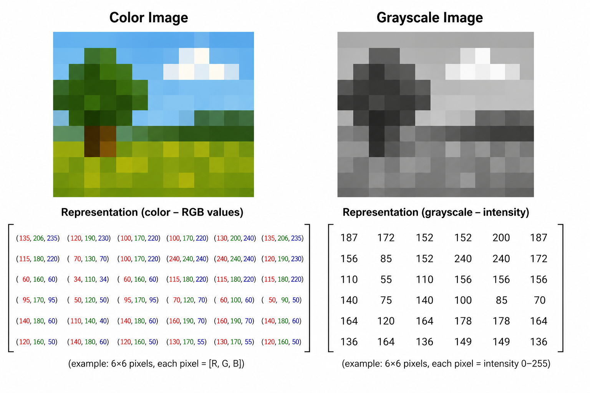
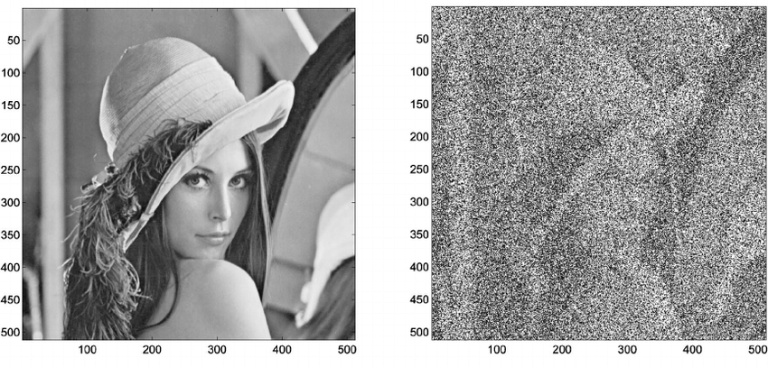
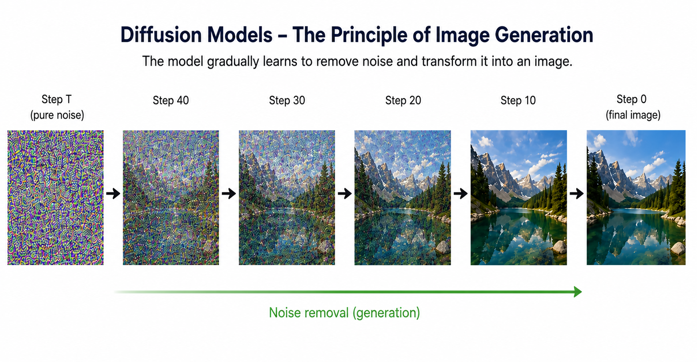
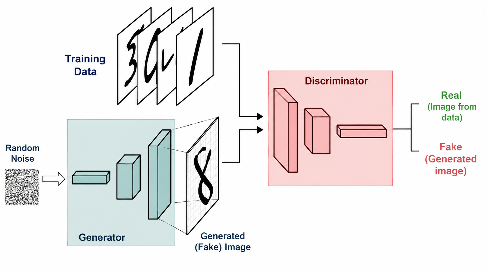
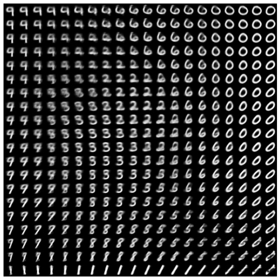
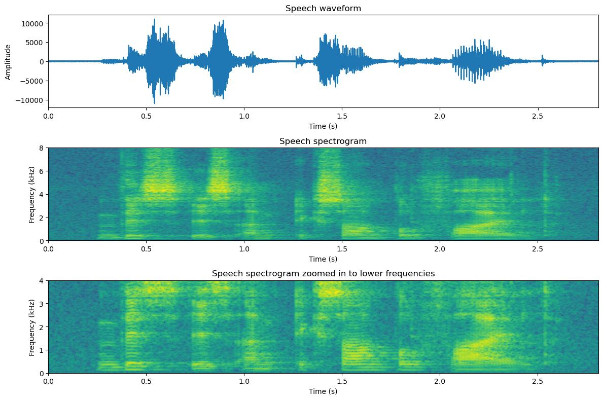
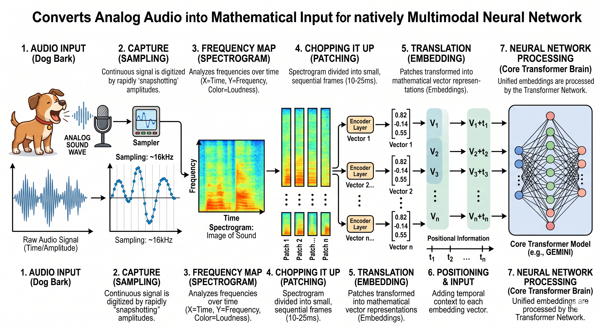
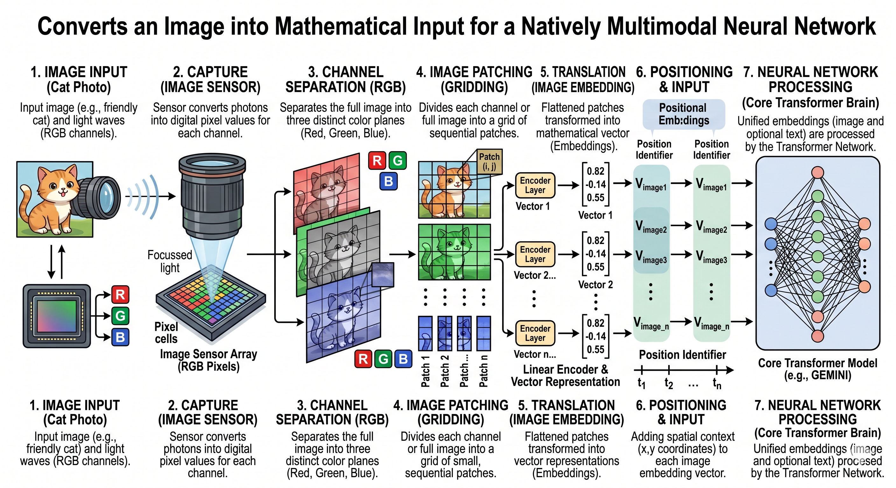

# Generative AI Beyond Text

## Introduction

Modern generative AI is no longer limited to text.

Today's foundation models can generate and understand:

- text
- images
- audio
- video

Although the outputs differ, they all follow the same principle:

> Convert the input into numerical representations, learn statistical patterns, and generate new data.

---

# How Computers Represent Images

A computer does not "see" an image.

Instead, an image is represented as a grid of pixels.

Each pixel contains numerical values, for example:

- Red
- Green
- Blue (RGB)

Example:

```
Pixel

↓

(255, 0, 0)

↓

Red
```

Machine learning models therefore process **numbers rather than objects**.

<p align="center">

</p>

---

# Diffusion Models


Diffusion models are currently the dominant approach for image generation.

Examples include:

- Stable Diffusion
- DALL·E
- FLUX
- Imagen

Basic idea:

1. Start with random noise.
2. Gradually remove noise.
3. The image slowly emerges.

<p align="center">

</p>

Training:

- Start with a real image.
- Add random noise.
- Train the model to predict and remove that noise.

Generation performs the reverse process.

<p align="center">

</p>

---

# Text Conditioning

The text prompt guides image generation during every denoising step.

The prompt is converted into an embedding.

During generation, the diffusion model continuously asks:

> "How should I modify this image so that it better matches the text?"

This allows the model to generate images that correspond to the user's prompt.

---

# Cross-Attention

Cross-attention connects **text** and **image generation**.

The model simultaneously considers:

- the current image representation
- the prompt embeddings

It learns relationships such as:

- where the cat should appear
- where the sofa should be
- colors
- composition
- artistic style

Without cross-attention, the model would generate realistic images but would not reliably follow the prompt.

---

# Latent Diffusion

High-resolution images contain millions of numbers.

Working directly with pixels would be computationally expensive.

Instead:

```
Image

↓

Encoder

↓

Latent Space

↓

Diffusion

↓

Decoder

↓

Image
```

Advantages:

- significantly faster
- lower memory requirements
- higher image resolution

This approach is used by models such as **Stable Diffusion**.

---

# GANs (Generative Adversarial Networks)

Before diffusion models became dominant, GANs were the most popular image generation approach.

GANs consist of two neural networks:

## Generator

Creates synthetic images.

## Discriminator

Attempts to distinguish:

- real images
- generated images

Both networks improve together during training.

<p align="center">

</p>

Today, GANs are still used in some specialized applications, but diffusion models have largely replaced them for high-quality image generation.

---

# Variational Autoencoders (VAE)

VAEs learn a compressed representation of images.

Architecture:

```
Image

↓

Encoder

↓

Latent Space

↓

Decoder

↓

Image
```

Advantages:

- structured latent space
- efficient compression

Disadvantages:

- lower image quality compared to diffusion models

Today, VAEs are commonly used as components inside latent diffusion models.

<p align="center">

</p>

---

# Image Editing

Modern generative models support:

- object removal
- background replacement
- style transfer
- inpainting
- outpainting

Instead of generating an image from scratch, they modify an existing image while preserving the remaining content.

---

# Audio Representation

Audio is a signal over time.

It is represented as a sequence of numerical values.

Example:

```
0.15

-0.08

0.27

...
```

Typical sampling rate:

```
44,100 samples per second
```

<p align="center">

</p>

---

# Speech-to-Text (STT)

Goal:

Convert speech into text.

Pipeline:

```
Audio

↓

Spectrogram

↓

Neural Network

↓

Text
```

Modern STT models use attention mechanisms to relate different parts of the audio signal to generated text tokens.

Examples:

- Whisper
- Gemini
- GPT-4o / GPT-5
- Deepgram

---

# Text-to-Speech (TTS)

Goal:

Convert text into speech.

Pipeline:

```
Text

↓

Embedding

↓

Audio Model

↓

Speech
```

Modern systems can control:

- pronunciation
- intonation
- emotion
- speaking style
- speaker identity

Examples:

- ElevenLabs
- OpenAI Voice
- Azure Speech

---

# Music Generation

Modern AI can generate music using several approaches.

## Transformer Models

Generate music token by token.

Often operate on symbolic representations such as MIDI.

Advantages:

- good structural control
- melody and harmony

---

## Diffusion Models

Generate music by gradually denoising random noise.

Advantages:

- realistic audio quality

Disadvantages:

- higher computational cost

---

## Latent Audio Models

Compress audio into a latent representation before generation.

Advantages:

- efficient
- combines high quality with faster generation

Examples:

- MusicLM
- AudioLM
- Stable Audio

---

# Video Generation

A video is a sequence of images over time.

The challenge is maintaining:

- consistent objects
- smooth motion
- temporal coherence

Modern systems use **spatio-temporal diffusion**.

Pipeline:

```
Video

↓

Latent Representation

↓

Diffusion

↓

Video
```

The model learns both:

- spatial relationships
- temporal relationships

Examples:

- Sora
- Veo
- Kling
- Runway Gen-4

---

# Multimodal AI

Modern foundation models increasingly support multiple data modalities.

Examples:

- text
- images
- audio
- video

All modalities are converted into embeddings, allowing the model to learn relationships between them.

Examples:

- image → text
- text → image
- speech → text
- text → speech
- text → video

<p align="center">

</p>

<p align="center">

</p>

---

# Foundation Models are Becoming Multimodal

Modern AI systems are converging toward unified multimodal models capable of understanding and generating multiple data types.

```
Text

↓

Images

↓

Audio

↓

Video

↓

Unified Multimodal Foundation Models
```

Examples include:

- GPT-5
- Gemini
- Claude
- Qwen
- Llama

---

# Summary

Despite generating different types of media, modern AI systems share the same fundamental principles.

Everything is represented numerically:

- text → tokens
- images → pixels / latent representations
- audio → waveforms
- video → sequences of images

Generative models learn statistical patterns from data and generate new content by sampling from those learned distributions.

The trend in AI is moving toward **unified multimodal foundation models** capable of understanding and generating text, images, audio, and video within a single system.