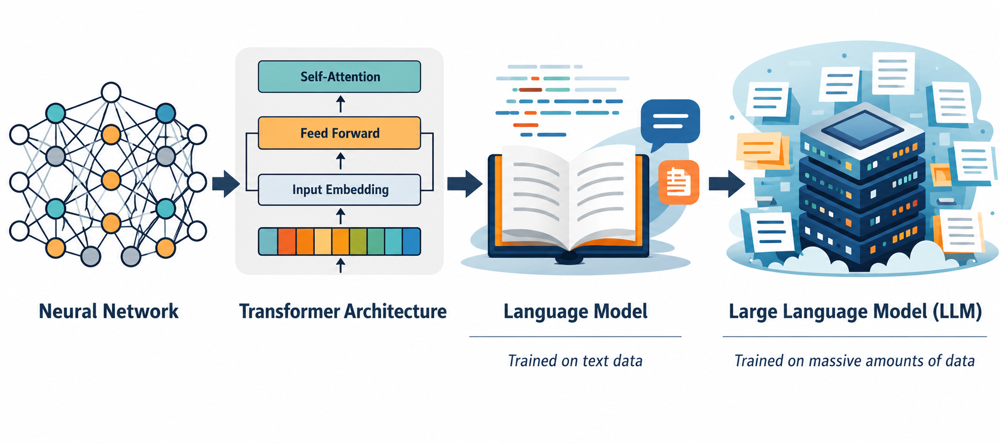
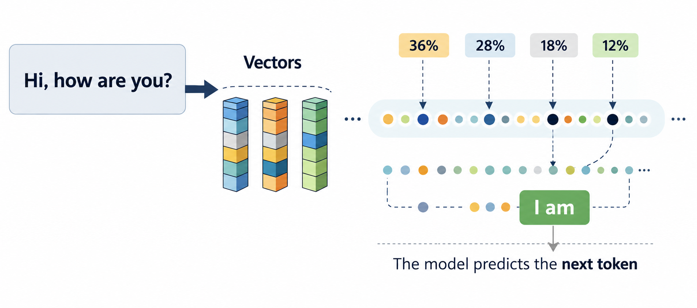

# Prompt Engineering & Context Engineering

## From the Previous Lecture

<p align="center">
  
</p>

- Text is divided into **tokens**
- The model generates text by predicting the **next token**
- It is based on the **Transformer architecture**
- **LLM (Large Language Model)** = a language model trained on massive amounts of text

The model generates responses **only from the information it currently sees**.

---

# Prompt Engineering

## What is a Prompt?

A **prompt** is the input we provide to a language model.

It may contain:

- a question
- an instruction
- context
- examples
- desired output format
- constraints

<p align="center">
  
</p>

The model uses the prompt to **predict the next tokens**, gradually generating the response.

---

## What is Prompt Engineering?

**Prompt engineering** is the practice of designing prompts that clearly communicate the task to the model.

The goal is to maximize the quality and consistency of the generated response.

> Modern LLMs are significantly more capable than models from 2022–2023.
>
> Today, most "prompt hacks" provide little or no benefit.
>
> The focus has shifted from clever wording to **clear instructions and high-quality context**.

---

# Modern Prompt Engineering Principles

## 1. Define the task clearly

### ❌ Poor prompt

```text
Explain AI.
```

### ✅ Better prompt

```text
Explain artificial intelligence to first-year university students.

Length: approximately 300 words.
Include one real-world analogy.
```

### Why it works

The model no longer has to guess:

- target audience
- desired level of detail
- response length

---

## 2. Specify the output format

### ❌

```text
Explain photosynthesis.
```

### ✅

```text
Explain photosynthesis.

Output:
- Markdown
- Maximum 5 bullet points
- One sentence per bullet
```

### Why it works

The model knows exactly how the output should be structured.

---

## 3. Use constraints

Examples:

- maximum length
- output language
- tone
- audience
- no tables
- JSON output

### Example

```text
Summarize this article.

Maximum 100 words.
Answer in Czech.
Use bullet points only.
```

Constraints reduce ambiguity and produce more consistent outputs.

---

## 4. Few-shot prompting

Provide one or more examples of the desired behavior.

### Example

```text
Question:
Dog is what type of animal?

Answer:
Mammal

Question:
Cat is what type of animal?

Answer:
```

### Why it works

The model continues the pattern it observes.

Few-shot prompting remains one of the most effective prompting techniques.

---

## 5. Iterate

The first prompt is rarely the best one.

Typical workflow:

1. Write the prompt.
2. Evaluate the response.
3. Improve the prompt.
4. Repeat.

Small changes often produce significantly better results.

---

# Techniques That Are Less Important Today

In the early years of generative AI (2022–2023), many "prompt hacks" became popular.

Examples:

- "Let's think step by step."
- extremely long prompts
- "magic prompts"
- universal prompts copied from the Internet

Modern reasoning models (GPT-5, Claude 4, Gemini 2.5+) perform most of these reasoning steps internally.

Today, these techniques usually provide little additional benefit.

---

# Context Engineering

## What is Context?

**Context** is everything the model can see while generating its response.

It may include:

- system prompt
- previous conversation
- user prompt
- uploaded documents
- examples
- retrieved information (RAG)
- previous model outputs

The model generates its response from the **entire available context**, not only from the latest user message.

---

## Context Window

The **context window** is the maximum amount of text the model can process at once.

It includes:

- system prompt
- chat history
- retrieved documents
- user prompt
- generated response

If the context exceeds the model's limit, older information may be removed.

---

## Example Context Windows

| Model | Context Window |
|--------|---------------:|
| GPT-5 Instant | 128k |
| GPT-5 Codex | 400k |
| GPT-5 | ~1M |
| Gemini 2.5 Pro | 1M |
| Llama 4 Scout | 10M |

> 1,000 tokens ≈ 700 words (approximate)

---

## System Prompt

The **system prompt** defines how the model should behave.

Typical responsibilities:

- role
- behavior
- writing style
- safety rules
- limitations

System prompts generally have the highest priority.

---

# Modern Context Engineering Principles

## 1. Relevant Context > Long Context

More text does **not** necessarily produce better answers.

Provide only information that is relevant to the task.

---

## 2. Remove Noise

Irrelevant information increases the probability of mistakes.

Less context is often better than unnecessary context.

---

## 3. Structure the Context

LLMs perform better when information is organized.

Example:

```text
## Task

...

## Context

...

## Question

...
```

Structured documents are easier for the model to understand than long, unstructured paragraphs.

---

## 4. Lost-in-the-Middle Effect

Transformers tend to pay more attention to:

- the beginning of the context
- the end of the context

Information placed in the middle is more likely to receive less attention.

Place important instructions:

- at the beginning
- or immediately before the user's question

---

## 5. Separate Instructions from Data

Clearly distinguish:

- instructions
- context
- user question

Example:

```text
## Instructions

...

## Context

...

## Question

...
```

This reduces the chance that the model mistakes data for instructions.

---

# Prompt Engineering vs Context Engineering

## Prompt Engineering

Focuses on:

> **How do I ask the model?**

Examples:

- clear task
- output format
- constraints
- examples

---

## Context Engineering

Focuses on:

> **What information does the model have?**

Examples:

- relevant documents
- chat history
- structured context
- system prompts
- retrieved knowledge

---

# Key Takeaways

### 2022–2023

The main focus was:

> **Prompt Engineering**

Finding better prompts often led to noticeably better results.

---

### 2025+

Modern LLMs understand instructions much better.

The biggest improvements now come from:

- providing relevant context
- removing irrelevant information
- structuring data effectively

Prompt engineering remains important, but **context engineering has become the dominant factor** in building reliable AI applications.

---

# Looking Ahead

The next step is giving language models access to **external knowledge** instead of relying only on what they learned during training.

This leads naturally to topics such as:

- Retrieval-Augmented Generation (RAG)
- Tool Calling
- AI Agents
- Memory Systems