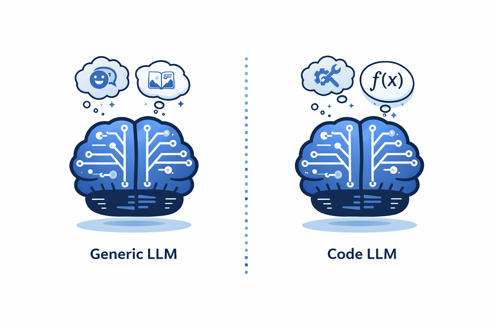
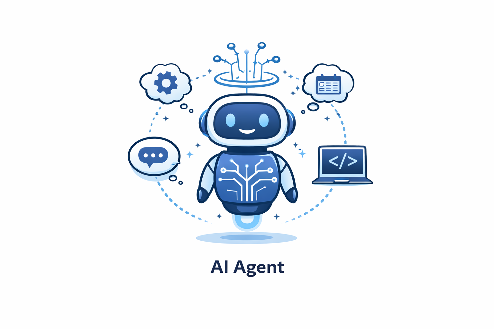

# Vývoj SW s podporou generativní AI

## LLM zaměřené na generování kódu

Velké jazykové modely zaměřené na generování kódu (tzv. *code LLMs*) jsou specializované modely trénované na zdrojových kódech, dokumentaci a veřejných repozitářích (např. GitHub). Díky tomu dokážou nejen generovat funkční kód, ale také ho analyzovat, opravovat a srozumitelně vysvětlovat.

Na rozdíl od běžného textu je u kódu zásadní:
- **přesné dodržení syntaxe** – i malá chyba způsobí nefunkčnost
- **práce s dlouhým kontextem** – model musí chápat strukturu celého projektu
- **determinističnost a přesnost** – kód musí být spolehlivý a konzistentní

Z toho důvodu jsou code LLMs často optimalizované jinak než obecné modely – kladou důraz na strukturované výstupy, logiku a konzistenci.

---

### Code LLMs

  

- **Claude 3 (Opus, Sonnet, Haiku)**  
  - uzavřený model  
  - silný v práci s dlouhým kontextem a analýze kódu  
  - Anthropic  
- **Codex**  
  - uzavřený model  
  - generování a doplňování kódu  
  - OpenAI
- **Gemini (např. 1.5 / 3)**  
  - uzavřený model  
  - zvládá velké projekty a multimodální vstupy  
  - Google  
- **DeepSeek Coder**  
  - částečně open source  
  - zaměření na výkon a přesnost  
  - DeepSeek  
- **Code Llama**  
  - [open source](https://ollama.com/library/codellama)
  - dobrý na doplňování a generování kódu  
  - Meta
- **StarCoder**  
  - [open source](https://github.com/bigcode-project/starcoder)
  - silný v Pythonu a backendu  
  - BigCode  

Specializované code LLMs jsou obecně přesnější při generování kódu, zatímco obecné modely (např. GPT-4, Claude) často lépe zvládají vysvětlování a komunikaci. Ideální volba závisí na konkrétním použití:
- **generování kódu → specializované modely**
- **učení a vysvětlování → obecné modely**

## AI nástroje pro asistenci při programování

### GitHub Copilot

    

GitHub Copilot je nástroj postavený na LLM, který funguje jako **kódovací asistent přímo v IDE** (např. VS Code, JetBrains).

- funguje jako „našeptávač“ kódu  
- navrhuje celé funkce nebo bloky kódu  
- návrhy se zobrazují šedě a lze je přijmout (Tab) nebo ignorovat  
- rozumí komentářům (např. `// vytvoř funkci pro XY`)  
- obsahuje i chat pro práci s kódem  

Technicky:
- posílá kontext (kód, komentáře) do LLM → vrací návrh kódu  
- historicky běžel hlavně na Codexu, dnes se modely mění  
- není to agent, ale aplikace postavená nad modely  

Další vlastnosti:
- dostupný jako extension do IDE  
- lze používat i na GitHubu (např. pro review PR)  
- umí pracovat s repozitáři (omezeně – spíše základní info)  
- placený (~10 USD / měsíc)  

---

### Copilot CLI

Verze Copilotu pro terminál.

- pomáhá psát shell příkazy  
- funguje přes příkazy jako:
  - `gh copilot suggest "najdi všechny .log soubory a smaž je"`  
  - `gh copilot explain "grep -r 'error' ."`  
- vhodné pro Bash, PowerShell apod.  

---

### Amazon CodeWhisperer

AI asistent pro psaní kódu od Amazonu.

- doplňování a generování kódu  
- rozumí komentářům  
- silně zaměřený na AWS ekosystém:
  - S3  
  - Lambda  
  - EC2  

→ v praxi „Copilot pro AWS“  

---

### Tabnine

Jeden z prvních AI nástrojů pro doplňování kódu (cca od 2018).

- doplňování kódu v IDE  
- důraz na soukromí  
- běh:
  - lokálně  
  - nebo ve firemním cloudu  

→ vhodné pro firmy s vyššími nároky na data  

---

### Nástroje pro generování testů

#### Diffblue Cover

Nástroj pro automatické generování testů pro Java.

- generuje unit testy  
- zaměřuje se na vysoké test coverage  
- specializovaný nástroj (ne obecný LLM asistent)  

---

#### DeepUnitAI

Nástroj pro generování testů.

- generuje testy jako text  
- méně automatizace než specializované nástroje  

---

#### CodiumAI (Qodo)

Pokročilejší nástroj pro testování.

- generuje testy  
- dokáže je i spouštět  
- zaměřený na kvalitu testů  

Poznámka:
- obecné LLM/agent nástroje často:
  - generují nekvalitní asserty  
  - vytváří tzv. *test smells*  
- specializované nástroje (např. Diffblue) se snaží o vyšší kvalitu a coverage  

---
### Snyk Code

Nástroj zaměřený na **bezpečnost kódu**.

- analyzuje kód bez jeho spouštění (*static analysis*)  
- hledá bezpečnostní zranitelnosti a chyby  
- navrhuje opravy  

Typické problémy:
- SQL injection  
- XSS (Cross-Site Scripting)  
- špatné zacházení s daty  

Technicky:
- primárně využívá machine learning a statickou analýzu  
- v některých případech (např. návrhy oprav) využívá i LLM  

Použití:
- IDE (během vývoje)  
- GitHub (např. kontrola pull requestů)  

Poznámka:
- zaměřuje se na **bezpečnostní chyby**, ne na funkční chyby  

---

### Modernize CLI

Nástroj pro **modernizaci a refaktoring kódu**.

- převádí starý kód na moderní verze  
- pomáhá s upgrady technologií  

Typické použití:
- migrace mezi verzemi frameworků  
- přechod na nové API  
- upgrade verzí jazyků (např. Python)  

Technicky:
- pracuje nad AST (*Abstract Syntax Tree*)  
- využívá definované transformační patterny  
- AI se používá pro složitější refaktoring  

→ vhodné pro dlouhodobou údržbu a evoluci kódu  

---

## AI Agent

    

Agent je program nebo systém, který dokáže **samostatně jednat, rozhodovat se a plnit úkoly** na základě vstupních dat a svého okolí.

Typicky funguje ve třech krocích:

---

#### Perception (vnímání)

- přijímá vstupní data  
- vnímá své okolí (např. text, obraz, data ze systémů)  

---

#### Reasoning (rozhodování)

- zpracovává vstupy pomocí vnitřní logiky (např. AI modelu)  
- vyhodnocuje situaci a vybírá vhodnou reakci  

---

#### Action (akce)

- provádí výstup nebo rozhodnutí  
- může generovat odpověď, upravit data nebo vykonat akci v systému

→ uzavřený cyklus vnímání, rozhodování a akce

---
## AI agenti pro podporu vývoje SW

### Codex jako AI agent
- **generuje kód autonomně**
- **pracuje v prostředí (sandbox)**
- umí:
  - spouštět testy
  - upravovat soubory
  - vytvářet pull requesty
  - používat nástroje (shell, git, API)

---

### Jak agent funguje (high-level)

1. Dostane zadání (prompt)  
2. Naplánuje si kroky  
3. Použije nástroje  
4. Vyhodnotí výsledek  
5. Opakuje cyklus  

Klíčový princip:  
> Model generuje akce → systém je vykoná → výsledek se vrátí zpět modelu → cyklus pokračuje

---

### Řídící smyčka (core princip)

Celý systém funguje jako **loop**:

1. Prompt od uživatele → LLM  
2. LLM vrátí odpověď:
   - buď text
   - nebo akci (např. „spusť testy“)  
3. Orchestrátor:
   - rozpozná, jestli jde o akci  
   - pokud ano → vykoná ji  
4. Výsledek akce se vrátí zpět do LLM  
5. LLM rozhodne, co dál  

Tohle běží pořád dokola, dokud není úloha hotová.

---

### Co je uvnitř systému

#### 1. LLM (mozek)
- chápe zadání  
- generuje plán  
- píše kód  
- rozhoduje další kroky  

#### 2. Orchestrátor (agent harness)
- řídí celý proces  
- sleduje stav úlohy  
- rozhoduje, co se vykoná  
- propojuje LLM a nástroje  

#### 3. Tooling (nástroje)
Agent může používat:
- terminál  
- git  
- test runner  
- linter  
- API  

---

### Execution environment (sandbox)

Codex běží v izolovaném prostředí:

- sandbox (typicky cloud / kontejner)  
- obsahuje:
  - kopii repozitáře  
  - runtime (např. Python/Node)  
  - závislosti  
  - testy  
  - shell  

Důležité:
- není to lokální prostředí uživatele  
- vše běží izolovaně (bezpečnost + reprodukovatelnost)  

---

### Proč to není jen tool calling

Rozdíl oproti klasickému tool callingu:

| Tool calling | Agent |
|--------------|-------|
| jednorázové volání nástroje | kontinuální smyčka |
| bez plánování | plánování kroků |
| bez paměti průběhu | sleduje stav úlohy |
| bez autonomie | autonomní rozhodování |

Chybí tam **akce + iterace**, proto to není plnohodnotný agent.

---

### Multi-agentní přístup

Pokročilejší setup:

- více agentů paralelně  
- každý má jiný úkol  

Příklad:
- Agent A → píše kód  
- Agent B → píše testy  
- Agent C → dělá code review  

Výhody:
- paralelizace  
- specializace  
- vyšší kvalita výstupu  

---
### Alternativy

#### Claude Code (Anthropic)

Anthropic nabízí podobný přístup přes tzv. **Claude Code**:

- agentní práce s kódem  
- schopnost iterovat nad úlohou  
- používání nástrojů (souborový systém, terminál, API)  
- plánování kroků a jejich vykonávání  

---

#### Gemini (Google)

Google přichází s agentním přístupem skrze **Gemini + nástroje / AI Studio / Workspace integrace**:

- silná integrace do ekosystému (Google Cloud, Workspace)  
- schopnost práce s kódem i daty  
- tool calling + postupně agentní chování  
- napojení na služby (Drive, Docs, BigQuery, atd.)  

Gemini zatím často funguje víc jako:
- rozšířený tool-calling systém  
- než plně autonomní coding agent typu Codex  

ale směřuje stejným směrem (agentní loop).

---

### Jak je to konkrétně v Codexu

Přesná architektura není veřejná, ale pravděpodobně:

- běží v cloudu (OpenAI infrastruktura)  
- používá sandboxované prostředí  
- má přístup k repozitáři a nástrojům  
- orchestrátor řídí celý agentní loop  

### OpenHands

OpenHands je **open source AI agent pro vývoj softwaru**, fungující jako lokální alternativa k Codexu.
Běh probíhá lokálně na PC, typicky v **Docker containeru**, kde je vytvořeno izolované prostředí obsahující repozitář, runtime a závislosti. Prostředí využívá dostupný hardware (CPU, RAM) a sdílí kernel hostitelského operačního systému, nejde tedy o plnohodnotný virtuální stroj.

OpenHands neobsahuje vlastní model, ale umožňuje napojení různých LLM. Podporovány jsou modely od OpenAI, Anthropic (Claude) i open source varianty.

#### BYOK (Bring Your Own Key)

API klíč je dodáván uživatelem a spotřeba je účtována přímo providerovi na základě tokenů (např. OpenAI nebo Anthropic).

Alternativně může být API klíč poskytován samotným nástrojem, přičemž účtování probíhá přes něj, obvykle za srovnatelnou cenu jako při přímém použití API.

OpenHands je jako software dostupný zdarma (open source), náklady vznikají pouze při použití externího LLM, pokud není provozován lokálně.

### Cline

https://cline.bot/

Open source AI coding agent integrovaný do editoru (např. VS Code).

- funguje jako agent (plán → akce → vyhodnocení)  
- má přístup k terminálu, souborům a git  
- běží lokálně  
- podporuje různé LLM (OpenAI, Anthropic, open source)  
- často používá BYOK (vlastní API klíč)  

---

### Cursor

https://cursor.com/

AI-first code editor (fork VS Code) s hlubokou integrací LLM.

- silná integrace přímo v editoru  
- kombinace chat + agentní úpravy kódu  
- umí refactor, generování i práci s celým repem  
- méně autonomní než plní agenti, ale velmi praktický  
- používá vlastní backend + modely (není čistě open source agent)  

---

### Devin

https://devin.ai/

Plně autonomní AI software engineer od Cognition Labs.

- cílem je kompletně samostatný vývojář  
- plánuje, píše kód, testuje, debuguje  
- běží v izolovaném cloud prostředí  
- vysoká autonomie (dlouhé tasky bez zásahu)  
- není veřejně dostupný (closed, early access)

#### SWE-banch

https://www.swebench.com/
